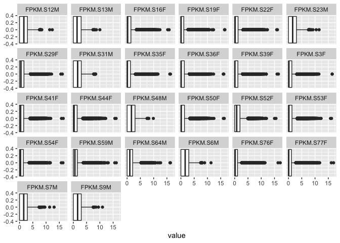
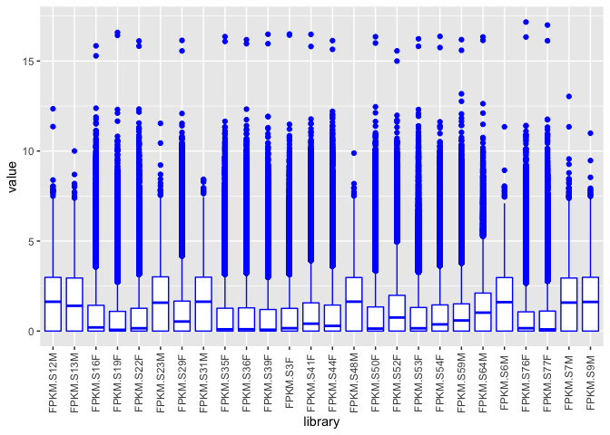
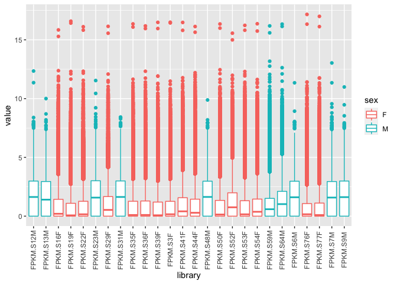

05-ballgown-boxplots
================

``` r
library(tidyverse)
```

    ## ── Attaching packages ─────────────────────────────────────── tidyverse 1.3.1 ──

    ## ✓ ggplot2 3.3.3     ✓ purrr   0.3.4
    ## ✓ tibble  3.1.2     ✓ dplyr   1.0.6
    ## ✓ tidyr   1.1.3     ✓ stringr 1.4.0
    ## ✓ readr   1.4.0     ✓ forcats 0.5.1

    ## ── Conflicts ────────────────────────────────────────── tidyverse_conflicts() ──
    ## x dplyr::filter() masks stats::filter()
    ## x dplyr::lag()    masks stats::lag()

``` r
bgown <- read.table(file = "ballgown_diff-isoform-expression/analyses/fpkm_all_samples.tab", sep = "\t")
```

``` r
bgown2 <- read.csv("ballgown_diff-isoform-expression/analyses/fpkm_all_samples.tab", sep="\t")
```

``` r
bbgown <- pivot_longer(bgown, cols = starts_with("FPK"),
                       names_to = "library") %>%
                       mutate(sex = (str_sub(library, -1)))
```

``` r
ggplot(data = bbgown, mapping = aes(x = value)) +
  geom_boxplot() +
  facet_wrap(~library)
```

<!-- -->

``` r
ggplot(bbgown, aes(library, value)) +
  geom_boxplot(color = "blue") +
  theme(axis.text.x = element_text(angle = 90, vjust = 0.5))
```

<!-- -->

``` r
ggplot(bbgown, aes(library, value, color = sex)) +
  geom_boxplot() +
  theme(axis.text.x = element_text(angle = 90, vjust = 0.5))
```

<!-- -->
